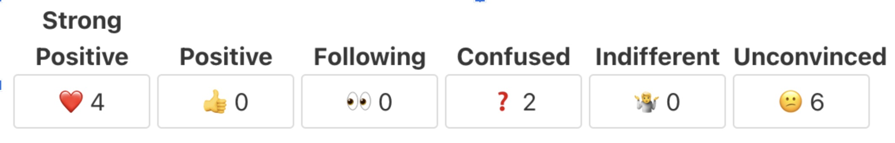
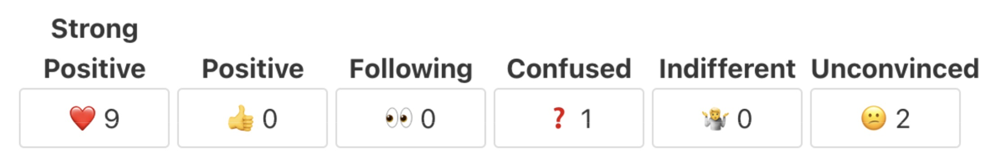
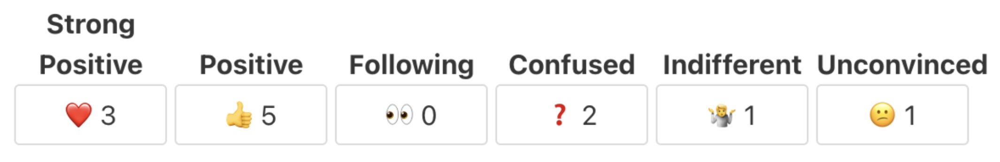

# 108th TC39 Meeting

Day Three—30 May 2025

**Attendees:**

| Name                | Abbreviation | Organization   |
|---------------------|--------------|----------------|
| Daniel Rosenwasser  | DRR          | Microsoft      |
| Daniel Minor        | DLM          | Mozilla        |
| Istvan Sebestyen    | IS           | Ecma           |
| Waldemar Horwat     | WH           | Invited Expert |
| Samina Husain       | SHN          | Ecma           |
| Jonathan Kuperman   | JKP          | Bloomberg      |
| Dmitry Makhnev      | DJM          | JetBrains      |
| Chengzhong Wu       | CZW          | Bloomberg      |
| Yusuke Suzuki       | YSZ          | Apple          |
| Zbigniew Tenerowicz | ZTZ          | MetaMask       |
| Ujjwal Sharma       | USA          | Igalia         |
| Steve Hicks         | SHS          | Google         |
| Ashley Claymore     | ACE          | Bloomberg      |
| Philip Chimento     | PFC          | Igalia         |
| Duncan MacGregor    | DMM          | ServiceNow Inc |
| Christian Ulbrich   | CHU          | Zalari         |
| Tom Kopp            | TKP          | Zalari         |
| Richard Gibson      | RGN          | Agoric         |
| Tab Atkins-Bittner  | TAB          | Google         |
| Romulo Cintra       | RCA          | Igalia         |
| Eemeli Aro          | EAO          | Mozilla        |
| Jesse Alama         | JMN          | Igalia         |
| Jacob Smith         | JSH          | OpenJS         |

## Opening & Welcome

Presenter: Ujjwal Sharma (USA)

USA: Hello. And good morning. I believe I am audible. It’s at least says so. Before we begin this morning’s session, a note to our transcriptionist. We will go all the way from 10 to 12:30 today. So for the first two ½ hours, and then end for the day. Hi, Dmitri. And hi, all right. We’re a minute… so should we do the call to note-takers first? Or let’s—let people—yeah.

USA: In the morning, in the meaning time, good morning. I hope the weather today has tempered some unrealistic expectations.

USA: All right. Good morning. And welcome.

USA: While we let more people file in, both in person and online. Let’s do the call for note-takers. Thank you, John. Great. Takers already before I finish. Yeah, this the last session for today. Who would like to help us? Thank you, Chengzhong as well. We already have note-takers.

USA: Please verify that the transcription is running. So I can actually verify that. Okay. Great. So we may begin with our agenda for today.

USA: Thank you.

## TG3: Security

Presenter: Ujjwal Sharma (USA)

USA: So on the agenda, first there’s TG3. By Chris. Chris is—relayed a message. So I will speak this out loud. For TG3, we have TG3 continues to meet weekly. Focused on the security impact of proposals. Please join us if you are interested in security.

USA: Perhaps I can give a second, if someone would like to raise any topic related to TG3. Anything you would like to add? No? Okay.

## Updates from the CoC Committee

Presenter: Ujjwal Sharma (USA)

USA: Next, we have—the queue is not updating for me. Oh, yeah. Updates from the CoC committee also by Chris and also something I could take for you.

USA: So for CoC Chris says, there’s an issue that has surfaced again. Regarding issue 62 in the twofold. The first is coming up with a statement that we can agree on in terms of what is acceptable use of tooling, and the second is, where that statement should live, example, contributing guide, how we work, code of conduct, et cetera. Please chime in on that issue. Issue number 62. Any thoughts or review? It’s been quiet on the code of conduct fronts. No new reports. Anyone transferred to reach out to a member. Thank you. So that was it.

USA: Any comments?

USA: All right. Racing fast. Next up, it’s you, Rob.

## Reviewers needed for SeededPRNG

RPR: So Jordan highlighted that when we advanced SeededPRNG to Stage 2 yesterday, we didn’t ask for reviewers for Stage 2.7. I think that KG has volunteered in the matrix. So thank you, KG. Could we get another reviewer or two?

Okay. JMN has volunteered. Anyone else? Someone is on the queue.

MM: Yeah. I volunteer.

RPR: Thank you, Mark. All right. We have three reviewers then. Very good. Sounds good. That is concluded.

## Comparisons (né Assertions) for Stage 1

Presenter: Jacob Smith (JSH)

- [proposal](https://github.com/JakobJingleheimer/proposal-comparisons)
- [slides](https://docs.google.com/presentation/d/1Nr-9OiZUilFlkUxKd4nHbJf3ie736zx335P_VCXVZ18/view)
- [slides—update](https://docs.google.com/presentation/d/1lMB6kn7wVR5Nreurg6ykZvNf5uprdJzM2IXP9BX4LvM/view)

RPR: So the next item is JSH with comparisons not assertions for Stage 1.

JSH: All right. So just a little bit of background on me, since this is my first proposal. I am Jacob. Representing open JS. I primarily work on node modules, test runner, stuff like that. And I am presenting a proposal for requesting Stage 1 for what I am calling comparisons.

JSH: So in this proposal, there are two fairly related problems: A versus B, and then failure output.

JSH: So A versus B. What is this? This is when we are trying to determine when A and B are sufficiently similar or different to each other. So when you have non-objects, this is pretty straightforward. But when you have like deeper, more complex objects, this can get much more hairy. The ecosystem today, this problem is pretty narrowly addressed either by expect or assert in—by many testing libraries. Node, for instance, and chai have a huge amount of overlap on their assertions. And for expect, jasmine and jest, I think are basically identical. And chai is in a very similar vein with some slightly different syntax. There’s also a proposal at Stage 1 for pattern matching that may solve this problem. There are a few different use cases for it. The one we immediately think of in test automation, unit test, stuff like that. But there is also a use case in production, where you use it for validation, in particular, for this example, user input, where it’s—on aggregate information. You can’t just apply a simple validation to single input field. You need it on the results of many of those input fields.

JSH: Whether to bring this into the spec, I thought of a few different reasons to do or to not. In the do column here, basically, every project is going to use at least one of the two cases. So, like, Step 1, install one of those libraries is going to do this. That seems kind of silly. Almost nobody cares about the subtle dinnerses between comparison algorithms and it makes it quite convenient when it is right there. Most other languages that I can think of have this functionality in some form or another. And also encourages good engineering practices. So we were doing ourselves a bit of a favor and would provide runtime efficiency, especially for the second use case. In automated testing, it’s not quite as important. But in a production app, more important.

JSH: Why we shouldn’t do this? This is already pretty well solved. There are basically four libraries that do this and pretty much everyone is using those things. It’s potentially a lot of work for implementers, aside from the problems have already been solved and figuring out how to go about these things. It’s more or less like pick one of those four. Or some combination of them. And also, there is very little here, if anything, that cannot already be accomplished in userland that doesn’t need special access to something. So we could leave it as it is.

JSH: The second part of this is failure output. Possibly, even more important than the first thing. So when you have A and B are not similar, there are a whole bunch of different ways to represent that and it can get very difficult to provide that information. So some like trivial examples here, if you are just going to throw this into an existing error object, it gets quickly complex and your output gets very quickly useless.

JSH: In terms of what information this should present, I think it is a question to discover over the course of Stage 1 to Stage 2, if this happens. Why to do or not to do this? The problem is not particularly well solved in userland, and customization is pretty much non-existent. The various libraries provide it in one form or another. And you can get the information that you need, but at least, in my experience, it’s not especially digestible.

JSH: Again, convenience. Runtime efficiency, it is particularly expensive to compose this output, especially the more complex, A and B become. And it cou potentially need special access to things. In node, for instance, we were able to provide that special access because we have access to the runtime. But for other things, not as much.

JSH: Why to not to do this? People could have very, very strong about what this looks like. So we potentially get into a bit of a religious war. It’s potentially a lot of work for implementers, especially because there are a—quite a few different options in userland now, and that is still sort of evolving. A native implementation will probably not—sorry. Ignore that. That’s a… a mistake.

JSH: Native implementation will have special access that userland doesn’t. That was from an old copy pasta. Sorry.

JSH: So in terms of what is explicitly out of scope for this proposal? It’s not a test runner and it’s not testing utilities. This is merely how to compare something and how to show the result of that comparison. Particularly, in the failure case. Problems that I think we can table for Stage 1 to 2, what comparisons specifically to include, for instance, if we go the assert route. `Assert.ok`, `Assert.equals`. Stuff like that. Specifically, how to do the deep comparison, so do we care about unenumerable problems on things, toString, stuff like that. Whether to go down the assert versus expect versus pattern matching or something else. What is in the failure output specifically? I think that’s something to explore during 1 to 2. And if or how to customize.

JSH: And that’s it.

DLM: First, I would like to say, thank you for the presentation. I thought that was very well done in a nice consideration of the pros and cons. And a good statement of motivation. My question in particular is, do we think that libraries would eventually switch to using a built-in version of assert? And also, you said, like, the existing versions are, like, 99% compatible. What about the 1%? Would we break even inadvertently because they expect a written des depending on something specific in one of the libraries?

JSH: Possibly. I don’t think we would break them but potentially not provide the specific thing that they are looking for. And that is, potentially an argument for allowing customization. So how we get that customization is a problem for mañana but for instance, if we allow it to be overwritten by a symbol, if you provide this, we will use yours. Otherwise, we will use ours. That could possibly cover it.

DLM: Yeah. And it’s not a Stage 1 concern. But I think as part of Stage 1, we should do outreach to various testing libraries to see if they are interested in the feedback they have

JSH: Coming from node, i have done that internally, reaching out to the other ones, for sure.

ZTZ: Hi. First of all, thank you for taking other use cases into account. And you mentioned the validation use indication. I like the idea of having this be useful for both testing and validation. This brings up one concern, about getters, Proxy, toString, valueOf, et cetera. And the treatment of those is—has different motivations in those two use cases. Potentially for assertions and testing, you would want to trust getters that they are returning the right values and compare the resulting values every time you call the getter. But for validation use cases, getters should probably be somewhat flattened, that after validation, they can’t return a new value anymore. Or comparing a value, a plain value with a getter should not be treated as equality. I don’t have answers. But I have a concern. Thank you.

JSH: Yeah. I think definitely something we will need to consider before probably Stage 2 or later.

PFC: I find generally the two use cases of testing and validation are served better by two separate APIs. For testing it depends on your test framework, you might want the execution to continue after an assertion fails in a test, but you add it to a log of things that went wrong in that test. Or you might not. You might want to abort the test at that point.

PFC: For validation in actual code, I think having an API that throws an error if the condition fails, like say, `console.assert` or `node:assert`, is generally a bad user experience. Because if you’re validating user input, which I personally don’t do with assert, then you don’t want to just throw an error and kick the user out of what they were doing. You want to communicate that they needed to provide different input. If you're using it to verify invariants, where it’s a programmer error if they fail, what you want is to abort the entire program and say "programmer error!" To me these are all very different use cases, especially the latter. I think it’s important to be able to switch the assertions off in production. So I am a bit skeptical of one API covering all those use cases.

JSH: I think the underlying use case that this could potentially address is effectively the same and then it’s a matter of the stuff that goes on top of that. So, yeah, talking about this on Monday, yes, it might be desirable to have slightly different behavior in different modes, like in production or something, and you might want to flag in some way, if, for instance, you’re calling `assert.ok`. To say like do blow up or like do continue. In production, when this is used for validation, I usually see the error captured and then presented in some kind of toast. But, for instance, if it is on a validation method of form, escapes me at the moment, on submit or something, it is okay for that to fail. And that is kind of what you want. Because it will stop the submission of the form. And I think you had one or thing that I forgot.

PFC: Not stopping a test if an assertion fails? Or switching on and off in production?

JSH: Yes. So not to stop the test, I think that could be addressed by at that flag of, like, do blow up, not blow up. If that is eventually the way to go.

DLM: Philip phrased better. I am skeptical about using assertions outside of test cases. This is something we do in the C++ codebase. It’s well, to basically handle when a programmer error and the variant has failed and we decided that it’s safer to crash the process rather than continue and risk the user security or privacy. I don’t think that behavior is super appropriate for web apps, and we also already have exceptions in JavaScript that can do something similar, at least in our C++ we have.

JSH: Yes. Except that for the exception, we don’t have an exception that, like, an instanceof error or some type of error that provides you particularly nice stuff. So that’s sort of the second half of this. And potentially, there is another way to trigger that. But I think how we go about it is something to figure out. So it may not necessarily be assert, like if we use the pattern matching route or something.

DLM: I am not quite sure I understood the nicer something you’re alluding to

JSH: So the second item of failure output, I didn’t have an example of it, of what it could look like because I didn’t want to prescribe too much. But, for instance, if you have a deep object and like three levels down, foo doesn’t agree, what do you show? You have—you probably want to say where it came from. What you are expecting. And stuff like that. So that’s the sort of thing that I think you’re getting at, with, if we don’t have anything from this, then we are kind of stuck with the ugly error of—not the ugly error. The not terribly helpful error stuff like here and then you have to do a whole lot of boiler platey stuff to get something useful.

DLM: Okay. That helps. Thank you.

JSH: Cool.

USA: There’s a reply by Steven

SHS: Yeah, I wanted reiterate in turning on and off production that one of the big values that is not served by anything right now is for dependencies, if you depend on library in code, and lot of times you bring in and you don’t have really any NAvs to customize how to works. Being able to kind of turn off assertions deeply actually is a good use case that is not handled anywhere.

MM: So several things. You start off with the alarm bells on special access to proxies. JavaScript, starting with ECMAScript 5, has paid a lot of attention to encapsulating information so that there are not observable differences between X and Y for many pairs of X and Y. In particular, for proxies, we don’t—we do not have a test in the language, even for whether an object is a proxy. So introducing into the language an ability to pierce through the encapsulation that we very carefully constructed is just a no-go. So that’s a negative comment.

MM: A positive comment is that in testing, the ability to have a standard way to produce differential diagnostics is good. We’ve faced that ourselves when not using the test framework equality, but rather using our own equality which is specific to the semantics of our framework. When we want to test with that, there’s no way to reuse the test framework's diagnostic output for the structural differences. But that brings up the other point, which is I don’t believe the 99% of users don’t care what equality—what deep equality algorithm is used, and there is two reasons for that: one is that for some objects, there—you know, for the purposes of the application framework, it’s written in, for some objects, the object identity does not matter, and you want a deep comparison to go through the structure; for other objects, the object identity is essential to the meaning of the object, and you want a deep comparison to be able to identify those objects and stop at object identity comparison. And there’s no way for a framework neutral deep comparison to know that. And so I think this thing needs—so I think that the value of the differential—standard differential things needs to be programmable by a framework-specific deep equality outreach. And finally, I am very skeptical about trying to solve both the testing use case and the validation use case with one—I think the reason why we often use the deep equality that is provided by the test framework is because even for us, where our actual equality is not something that quite fits the deep equality from the test framework, quite often, the deep equality is good enough for testing purposes; but it’s never good enough for validation purposes.

MM: So I want to say that altogether, Stage 1 is loose enough that I am not objecting to Stage 1. But Stage 1 is about the problem statement to be solved, rather than the mechanic I by objections, I think are all about the mechanism, but that leaves open, I am not clear what the problem statement is. And I can’t approve it for Stage 1 that understanding a problem statement that is distinct from the proposed mechanism.

JSH: Okay. I will try to—I think there were five different points inside there. I will try to do them in order. So for the special access to proxies, I am not expecting to provide any special way in the test itself for you to identify that it is a proxy. This was in the failure output telling you this was a proxy for debugging. So like –

MM: So the test output of this comparison, the diagnostic output, not it’s—not itself available to code in the language?

JSH: It would be, because, like, you could inspect it. But it is not going to have, like, a flag that says "is proxy". It would be –

MM: But then, you can use that diagnostic output to tell something is a proxy.

JSH: You could… Yes.

MM: Okay. So that’s a no-go.

JSH: Okay. Then… sorry. I forgot. There was something right after that. Well, okay. You were saying that for validation, that the –

MM: That a generic deep equality is—I do not believe that the—that 99% of users or—users of particular frameworks can—that it’s appropriate to use a generic deep comparison for validation because different frameworks will have different notions of what are meaningful differences and what are not so meaningful differences, and in particular, on object identity. For some frameworks, for some objects that the framework can identify, you want the deep comparison to stop at object identity. But there’s no way for a framework neutral deep equality to know for which objects it’s the identity that matters for the deep comparison—for the otherwise deep comparison.

JSH: So, for instance, if thinking about testing a react component or something, it would definitely not –

MM: I am specifically talking about the validation case. It applies to both cases. But it applies with more urgency to the validation case. The validation case, the use for a generic deep equal is much smaller than for the testing case because if a test doesn’t quite fit, often it’s good enough. For validation, that is not true.

JSH: Can you think of an example of what this would be? Because when imaging it, for instance, in my—my example here, it is arguably, yes, trivial. If you were going over the whole data of the form itself, and like all of the values that the user has provided, I can’t imagine how you could possibly encounter this problem

MM: So as a particular example. Let’s say that there is a class that defines a procedural-only API. All of the data is encapsulated and hidden in private fields and the interaction with the object is by invoking methods on it. For that, the only difference between instances of the same class is their identity. And that identity can often matter. What would a deep equality do with that? Similarly, if the same—if the same class code is evaluated multiple times, into multiple classes, such that instances of one are not or otherwise look the same, what would your deep equality do with those?

JSH: Well for a deep equality, that will say, they probably are the same. I think this is maybe a detail for Stage 1 to 2. But to answer your question, if you’re looking at the shape of it, it would say the shape of this is the same. Otherwise, you should use a different assertion.

MM: So I am skeptical that—so restate, I am skeptical that a generic deep equality will often be useful for validation because validation cares about these differences.

JSH: Okay. But again, if you are—if you want to check that specifically, then I think that is a different assertion.

MM: Yes. And I am saying that often, you will want to check that. You want to check that with a deep equality, that is, that comes from the framework that creates the semantics, whether the identity of an object matters or not to the framework.

JSH: It is –

MM: So, therefore, all I am saying is that I am skeptical that a framework neutral deep equality will often be useful for validation. That you will often instead turn to a framework provided deep equality. For validation.

JSH: Yeah, it’s possible during the next stage we could discover that. This could potentially also be addressed by customization, if that is deemed to be something desirable.

MM: So I agree with all of that. The question is, this goes back to the question, this does not need to be—certainly not a blocking issue for Stage 1. But to go to Stage 1, I need to understand what the problem statement is, independent of the particular mechanisms you are proposing to solve the problem.

JSH: So the problem statement is two fold. For A and B, figuring out whether they are sufficiently similar or dissimilar. In a standardized way, in a very similar vein to the vast majority of other languages that provide this, and the second item of what I am calling failure output, not a great name, is presenting the information to you in a usable, helpful way. Does that… sufficiently summarize it?

MM: Yeah. Thank you for that. On that basis, I am happy with Stage 1.

JSH: Okay. And I just thought of something. If I could jump back. If we have the two different modes of, like, basically production mode and dev mode or something, what if we identity that something is a proxy only in dev mode? Then you can’t really do anything with that.

MM: So that’s an interesting question. And when we’re testing, we basically—in our frame work we basically set up the equivalent of that for various configuration switches. So I am not opposed to that. But introducing a distinction between dev mode and production mode into the language is itself an interesting thing to introduce that will raise many issues. But that’s also something that exploring that as part of the Stage 1 exploration seems fine.

JSH: Cool. Thank you.

WH: We have been making heavy use of the word “validation”. But what do we mean by it? Is it validating user input?

MM: So what we do a lot of is input validation of the arguments to a method or the arguments to a function. And if they don’t satisfy, you know, what you would—you know, what you might have wanted to write down as preconditions, we do input validation instead because we’re starting to be robust against maize behavior of callers. So do a lot of input validation. And the other thing that was mentioned that I agree with is, sanity checks. You know, if X does not equal Y at this point in the algorithm, that can never happen. If it does happen, we are corrupt and should stop.

WH: Okay. That would be —

MM: Because to continue with a corrupt state in production would have the potential to do great damage. And you would prefer to stop, rather than do damage

WH: What you are calling validation, I would call invariant checking. For me, validation is, when a user types some text, making sure that the text is appropriate for the fields which they’re entering. I suspect this is not what you mean by validation?

MM: That is not what I mean by validation. Or it’s not the main—it’s not the validation I care about. I don’t object to having the same term also cover that case. But, you know, in the security context, input validation is distinct from preconditions because the meaning of precondition is that it’s often not—there’s no assumption that it’s checked, rather it’s an obligation that gives the permission to misbehave. In other words, the callee is only obligated to satisfy its invariant and post-conditions if the preconditions are not violated. Input validation says that the input conditions might be violated, but the callee is treating that as as inertia put value days violation and rejecting the input rather than excusing misbehavior of the callee.

JSH: I would say it covers both. I didn’t have a broad enough or specific enough term, I guess, to cover both. My example was user input because it is impossible to know what is coming in, whereas the invariant thing is a little bit more, "you shouldn’t have". But it could be for both indeed

WH: If this is for both, then we have an issue of asserts getting omitted for user input validation.

JSH: I’m sorry, what?

WH: If you are using assert for both user input validation and invariant checking, if you run the code in a production mode which removes the asserts, then you will have a problem.

MM: Right. It’s another—that’s another good—thank you, that’s another good point about why, including testing scattered throughout the code that is turned off in production mode, has to be distinct from validation.

WH: Okay. So we have a Tower of Babel of terminology here. I also don’t understand how deep equality is useful in invariant checking or validation? Or in function preconditions? It’s hard for me to imagine a function for which a precondition requires testing deep equality.

MM: We have those all over the place

WH: Can you give an example? I am trying to see how it —

MM: I’m sorry. We are doing deep examination. We’re rarely doing deep equality. So that’s a –

WH: Yeah.

MM: I think I was skipping a case in my head. We do deep examination so that it’s distinct from this, we do occasional do deep equality. But not often. Thank you.

WH: Deep examination is useful for testing preconditions. I just don’t see how deep equality comes into the picture.

MM: Okay. I agree with that.

SHS: Mark mentioned the idea if a debug assertion or invariant check fails, it could be dangerous to keep going. And I think there is—in case here where in some cases it’s true and you want the safety in production. In many cases developers want to litter the code all over the place with the check assertions and don’t want to spend the bytes in production. If this fails, I want to find out at test time and so that I think it’s important to tease out. Beyond just saying, there are two different kinds of debug versus input validation, but even sort of the debug time, is this important or not in production?

MM: Yeah. That’s a good point. That one would also require the sanity checks that happened in developer mode, but are trying to catch everything that would be a—a halting—an indication of corruption on which you should halt. The only reason to turn those off in production is performance under the assumption that you’ve tested enough during development with those assertions on, that you’re now confident you’re not going to encounter violations of those assertions in production that you did not catch in development, that is a valued use case and for that, you still need frame work accurate comparison, rather than good enough for, you know, for other kinds of testing.

SHS: Yeah. That’s how we use it in practice as well. I think we do all the testing and turn it off and that’s why it’s safe to turn off because you have tested it extensively.

MM: Yeah. So that’s a valid use case and that has deep comparison even in development-only mode.

SHS: This question of deep versus shallow assertions is a good argument for matchers. The presenter mentioned the—use a different assertion at the top level. That’s not always feasible when you want to tweak that nested or deeper case, you want to say it’s a deep assertion for the outside object. But then, this property should be shallow. And you don’t have a way to say the top level—if you switch, you can’t tweak individual objects. A matcher the whole point of that proposal is to nest them

MM: I haven’t followed the pattern matching proposal in general. I will just admit because I am skeptical that it’s way more complicated than it needs to be, but what I do believe in is stark distracters and given extractors build the minimal match construct such that you’re not solving with match things that can be solved with extractors. But, yes, in that context, it did have in the back of my mind, extractors for the more semantics-based comparison so I agree with you overall.

ACE: Hi. Sorry, my throat is a bit bad. Hopefully it makes me sound cool and husky as opposed to inaudible. I have said on the queue the problem statement is quality not validation. The thing I kind of want to say is more: the scope here is really, really big. And I will say two things. One, don’t really think—I think this should be narrowed down before it goes to Stage 1, because I think there’s just too much happening here to work well as a proposal. But on the flip side, as a human being, that’s also been a proposal champion, not getting Stage 1 can be very demoralizing and I wouldn’t want, if Stage 1 can be useful to just signal, yes, please do spend energy and your time and the space, and I do want people to spend time and energy on some of the things we have talked about in this space. So in that regard, I would like this to go to Stage 1, in that I like wind in the sails, yes. But I would want kind of a rapid reduction in scope and broken up into smaller proposes because there’s a lot going on.

JSH: I absolutely agree that it is very large. And what you said is exactly my thinking. I was hoping for stage 1 to validate yes, the committee believes this is something to investigate. I didn’t want to spend tons and tons of time and the committee to say "your whole thing is flawed, go away". And I was thinking that this would probably end up getting broken into multiple proposals. But the reason I presented it as it is now, is because I think the broader picture of them is useful to figure out—useful to see why they’re all kind of needed.

USA: Next on the queue, The important distinction here is validation of JSON/POJO versus validation of objects passed around in the program, from ZTZ.

ACE: Yes. Assertions here, a few times we have said, where there’s a deferring of opinion we just pass flags. And the more we pass flags and option bags into these things, the less appealing it is as here is a really useful API you can use off the shelf because it actually won’t be that useful because it won’t be opinionated enough. I would imagine what would end up happening is, test runners, you still end up—you are writing tests, you don’t use this API directly, you still just use your test run or assertion thing, the value is diminished there because you want to just set a flag once and then the test runner automatically then says, okay. I will always pass that down into the assertion rather than the test and keep doing that. One of the things is to put something in the standard, we are locking it in. It’s real hard to change things. This is subjective, even in the nodes assertion, it was sloppy and then strict and partial, and it maybe we want to add some way of having protocol to add equality for custom classes, to me that all says, this is why it works better as a user-land library, so people can pick the one that closely matches what they want. And when there is a breaking change, they can decide when they update their package, et cetera. All things we can’t do in the language. Which is then—to return to my earlier point,—what we could actually do in the language is a very, very narrow thing, and not—not trying to replace a full assertion library. I think that’s—it’s just to objective for something to lock in

JSH: Yes. For sure, having to pass the same flag a lot of times would be very annoying. But in terms of like how you would customize it, I would try to avoid that. There are quite a few ways to do this. So, for instance, one of the ways that I was considering exploring was this "known symbol" kind of thing. You could attach it. And then sort of like globally override the behavior with your kind of like one and done customized way of doing whatever it is. Things like –

ACE: Only solves the custom task case. People shouldn’t be putting a symbol on a string because they want to make string comparison case insensitive.

JSH: I was thinking this one thing would not go on the individual—one on symbols wouldn’t go on the individual things you are testing there. Possibly something you will assign to assert. If you want to override part of how one of the comparison algorithms work, you could do that. Maybe that’s a bad idea. But I think this is what you are getting at. If you are having one of the frame work specific libraries, that maybe is exactly what they want to do. In node, we encounter this a lot: "We want 90% of what you are doing. We want to change like the 10%. Please give us a way to do that." Rather than, redo the whole thing or basically copy-paste all the implementation and change five lines.

ACE: Yeah. Word of caution: We have struggled in the past with global configuration if we say in the spec like you can assign to `assert.customization` function, there be dragons.

JSH: Yes. Sorry. There was one other point that has just run off my mind. Oh, sorry you were talking about when the libraries are introducing break in changes. One of the reasons now is a decent time to do this is, we have had 10+ years of user-land solving these problems for us. So this space is quite mature. I think quite a lot of the problems will have already come up and about have been solved, or if not solved, they have specific reasons why they haven’t been solved. We can benefit from that existing experience.

USA: We have a reply by Jordan.

JHD: Yeah. I wanted to add, like, I agree with Ashley. We definitely wouldn’t want global state. But node actually has a pattern not only node, but like for create require, so you don’t have to pass the, like, base URL every single time. And I think a similar create assert API could handle customization without creating a whole bunch of global state mess. And that way, you make your own assert function that—pass your flag that way and the results function, pass that around your app. Et cetera. This is more like before Stage 2. But just pointing out there are options.

JSH: I really like that idea. Thank you.

MF: I will try. I guess Ashley ended up covering all of the things I wanted to cover. Maybe I will focus more on the way I see forward for this. So, you know, like as you have said multiple times, there are many components to this proposal at the moment.

MF: I feel like we are spending a lot of our effort here thinking about the whole equality comparison part of it without really considering the context that it’s in. Which is the assertion calls and the formatting of the messages and compiling them away. I think that we should start by focussing on that space of where they’re going to be used. And when they have proven themselves useful with a simple case like just SameValue comparisons going and trying to expand the different kinds of notions of equality that you can use with this style. You know, I think if we try to move these all forward together, we are going to continue doing this design work with how deepness works and how customization works and stuff. And if we do all that work and then find out the context used is not useful and people are not adopting it or running to some issue with tooling or things we don’t know yet, that is all wasted work. So I would suggest doing kind of an ordering of those parts of this proposal.

MF: And possibly like modifying what you are asking for, for Stage 1, just be, you know, I am not going to repeat it again. But just be that part

JSH: Yeah. Fully on board with iterating in smaller chunks. I was thinking that part of the exploration of 1 to 2 would—that’s when we tease out what the different parts are, potentially, break them off, start with the prioritized list of, like, this one seems to be the most important. Let’s go for that. Hash it out. And then potentially move forward with other pieces.

WH: Yeah. For Stage 1, I don’t understand what the problem space is that this thing is trying to address. I see deep equality here. I see exploration of debug modes. I see message formatting. I see testing of preconditions. Possibly destructuring. And I just don’t understand what the problem space is.

JSH: I think you just listed it.

WH: Well, that’s a collection of different proposals. I just don’t see what’s —

JSH: If you have this debug mode, and so let’s say you have the thing that the debug mode is going to apply to, but then you don’t have the debug mode in it, and that’s a really desirable component are you have a chicken and egg problem. No?

WH: Why should deep equality depend on debug mode? Message formatting depend on debug mode?

JSH: Yes. I think the reason I did this, it helps identify what the whole thing is. So again, I am happy to break these into multiple things, figuring out how to do that and getting consent from the committee that this is a space to explore is what I am looking for

WH: Yeah. I am trying to understand what the problem space is. It seems like a space for a collection of related or interacting proposals.

JSH: Yes.

RPR: Would it help to scope it just as Michael said? Earlier, just do restate that narrower scope?

JSH: Yes. Do you want me to do that right now?

RPR: Let’s see if that helps Waldemar

JSH: Okay. Can I come back to that?

WH: Sure.

JSH: okay. Thanks.

RPR: Okay. That is the end of the queue. If you wish to come back, we have got another 90-minute topic. Would you like to, perhaps, condense that and verse a single slide with the problem statement and then we could return to it, at the—as the next item just to 5-minute continuation.

JSH: Yes. Perfect. Thank you.

RPR: Okay. Thank you, Jacob.

JSH: It sounds like in general, there are quite a lot of approval for our interests, in exploring the various cases covered. Particularly, the different modes. And it is applicable in the different spaces. Particularly, the output in more useful fashion and its usability for like the general cases that we know now, and a Mark (MM) pointed out, invariants and like that. But narrowing down more specifics is needed to proceed.

### Speaker's Summary of Key Points

Comparisons was split into 3 proposals—this was expected, but not so soon.

- Inspector: detailed information about one or more values. This can be used on its own, or by other features (such as Comparisons and Pattern Matching).
- Modes: mark code to run conditionally. This is effectively a replacement for NODE_ENV (but also available in the browser).
- Comparisons: determine whether a value meets certain criteria. Think "assert" or "expect". It may ultimately work with Patterns Matching (whereby the expected value is or contains a Pattern).

How they may fit together:

```javascript
production: const result1 = compare(a, b);
local: const result1 = compare(a, b);
```

result1 may be an instance of Inspector.

Supposing `a` is a proxy, in local, that Inspector instance would tell you `a` is a proxy; but in production, it would not (because proxies are supposed to be undetectable).

### Conclusions

- Modes is especially enticing for its broader applicability.
- Inspector seems broadly useful too.
- Comparisons is the biggest and there be dragons. The scope will likely be fairly narrow initially (probably 3 methods will cover most cases).

## JS Numerics breakout session

Presenter: Jesse Alama (JMN)

- [slides](https://notes.igalia.com/p/tc39-2025-05-decimal-minisummit#/)

RPR: All right. So next up, slightly different type of agenda item. In previous meetings when we’ve done breakout sessions they have been in separate rooms. For now, let’s keep it within the regular plenary, the point is, we get note-taking as part of this. So Jesse, are you ready to begin with numerics

JMN: Yes, I am. Just to expand on what Rob said, the thinking with this mini summit is looking for any kind of discussion of decimal. I know that everyone cares and not everyone is interested in, you know, digging into the details with us at the same level and that’s just fine. You know, think of this as a breakout session. If you want to hack away or leave the room, that is absolutely fine. You do not have to hang out with us and get into the weeds about these issues. Yeah.

RPR: Sorry. Chengzhong pointed out…

CZW: I need to get off. We get a new note-taker to replace me.

RPR: This is the last session. It won’t last long.

RPR: Perhaps someone online.

ZTZ: I can continue to help with note-taking. We have been doing—someone else would have to be in there with me.

RPR: Okay. One more volunteer, please. Given this is not an official plenary, and so on, I think maybe we proceed just with one note-taker.

RPR: All right. Yeah. Just to emphasize with the—Jesse’s point, this is more of a specialized topic and we might want, for example, I should ask the question. Do you want to use the queue? Do you want a chair to moderate, or… ?

JMN: We can use the queue. And then if that ends up being—slows us down or feel it’s unnecessary, then we can perhaps change. But yes, initially, let’s use the queue

RPR: All right. In which case the first question Waldemar asks on the queue is: What are we trying to do in this discussion? What is the goal?

JMN: Yeah. Exactly. This is… This is where it feels a bit awkward to present this to the whole plenary. But the thinking behind this workshop is to try to hammer out some details about decimal. Ultimately what we are trying to do is trying to smooth out any outstanding issues in preparation to potentially going to Stage 2. In discussion with a number of people here and some online, who are not here, we are identified a few topics for discussion. These, we hope, are some of the main things that need to be fleshed out. I would like to avoid getting stuck in the weeds on some of these things. If possible, one of the issues, for instance, looking at this slide, one the issues is maybe the README for Decimal needs to be improved. I can share a link to a Github PR where we could work on that together here in this little mini summit.

JMN: There’s some discussion underway about the amount topic. That’s a very interesting topic and there’s still a number of big details to be decided on there. That’s what I have in mind with this very compact, string-backed amount thinking. This decimal from is a minor point, we can perhaps skip that. I just added that recently. This also—the final point moving on to units is related to this amount concept. That was presented earlier, the thinking being that there’s a—an interesting overlap between the measure and decimal proposal and we’re trying to think of how this amount concept can be forward compatible with what we’re going to be doing in the measure proposal. There’s a number of interesting issues there, thinking about units and unit conversion that we might want to get right in decimal, so that we have the ground prepared for moving on to the measure proposal.

JMN: So yeah. I realize this is a bit free form. Very atypical for any presentation in plenary. We can discuss things in the chat channel, if you would like to contribute remotely. If there are any decimal and measure fans out there, there is a dedicated matrix channel for this topic. I can add a link to that or someone could perhaps add a link to that channel in the delegates channel to get visibility. Perhaps you would like to discuss and don’t know about the channel.

RPR: On the queue we have Shane to talk about goals.

SFC: I assume Waldemar’s question got answered. I think Jesse just pretty much answered it. I am on the queue then with goals. Yeah. Regarding the first point of improving README, I think that the—like why are are improving the README? It’s because whenever I question what exactly are the problems trying to solve in proposal decimal I go back to the README file and re-read the use cases and goals and I feel the way we have been working is as the champions have deviated a bit from the documented use cases and goals that we have in the README file. I think that is one of the things I am hoping to get out of this topic on the breakout session today is, you know we have a very long and wordy use cases section and I would like to make it concise and pointed. So make sure we know what the problem is we are solving because if we know the problem we are solving, then the solutions flow much more naturally from that.

EAO: What you have there about the `Decimal.from` versus `new Decimal` is actually something I thought I would raise explicitly, especially that we have a wider audience here and one of the relevant parts of the API design for Decimal.Amount. We have a couple of different choices for how we construct a new decimal object or construct a new amount object. And in particular, in these discussions, and other places, we need to address what sort of a style of object creation we ought to use going forward. Do we specifically, do things like use a constructor that can take multiple arguments and so on, or do we possibly follow the model presented by Temporal where there’s many more static .from methods and otherwise there’s a lot of stylistic choices made in Temporal that could be applied beyond Temporal, but about which I don’t think we’ve discussed. I am not aware of us discussing whether the style of the APIs in Temporal ought to be used in JavaScript more widely going forward.

PFC: Yeah. So this style of constructors versus from methods that make more types of input five years ago this distinction already existed in the Temporal proposal. And the justification that we talked about in time was JavaScript developers don’t like classes and don’t like to use constructors or new. And I am not sure that that assumption is correct anymore. So yeah. Do we want to continue prolonging that because of something that is based on an outdated assumption? I don’t know. Like, I think that the split is between low level and high level construction is a neat division, but it might be lost on most developers who want to casually use the API.

RPR: Okay. Shane?

SFC: Yeah. So Temporal exists and designed the way it is, I think if Temporal had been using constructors to be flexible construction, then that is the pattern to follow. Given Temporal is like for better or for worse, setting the new standard for, like, how we design these types of APIs, then I do think that following Temporal is something that should very valuable for us to follow. I do think that it produces fairly readable code. Without using constructors, you know, it allows for chaining operations to be a little bit easier to read. And so I definitely do think we should try to follow Temporal. I think that for two reasons. . One because, you know, I have a slight personal bias towards preferring that style. And second, because Temporal is there and we should try to be consistent with it.

RPR: Next up Nicolo

NRO: What is the high level and low level construction for decimal. For Temporal we have a bunch of numbers or options bug. What are these two things for decimal? If we have two different things.

DLM: We have a point of order about reloading TCQ. We have done that so that might help.

NRO: I think a possible answer to myself is for the amount it’s clear we have possibly options. I wonder whether it’s also like what—like is there a possibly decimal factor that actually takes an option bug for plain decimals?

JMN: Yeah. There could be. Having to do with rounding, for instance. One can specify, let’s say a digit string as an argument to a decimal constructor or factory method and then specify what to do if rounding needs to occur, just in constructing the value. But other than that, I think there’s no other options.

SHS: Yeah. I just wanted to say that to the point about the class dial no longer being disfavoured, I do see a lot of sentiment that developers prefer functional style over classes. I think that’s still valid. And also I think factory funcs is still a best practice in a lot of languages. We shouldn’t be shying away from it.

DLM: Okay. NRO in the queue again. This is the point you already made. I will skip it.

MM: I am skeptical about the notion,—this is a response to Shane more than anything else—skeptical of the notion that Temporal sets the precedent for new APIs, rather than the entire rest of the language. I do agree that classes are not disfavoured by developers, and our existing APIs outside of Temporal are very much class-like APIs. However, on this particular question, for different reasons, I think I favor the “from” because I think of “new”, you know, instantiating the class, if that’s appropriate when the freshness of the resulting object is important and for decimal, the fleshness of the resulting object is as unimportant as possible, especially since the new values themselves are deeply frozen. So mainly, I wanted to make the point about we have not agreed to follow Temporal as the precedent setting for new APIs in the language.

DLM: Shane?

SFC: In response to one of the other questions, I think was it from—about high and low level constructors. So decimal in my mind, has primarily high level constructors in the sense you are constructing a decimal from something that contains a decimal number. Right? Like a string. Or you’re converting from a number, number or a BigInt. Maybe we can have some structured object to accept, some kind of, you know, scale and mantissa object. I don’t know. In general, you are building from something that is not a decimal and that’s more of a builder than a constructor. You know, in Temporal, that will be put in the from function. You have the 4 or 5 differential things you can stuff into the from function. And then the new function, builds it up from the low level data model, which is always ISO and ISO year and month and day and TimeZone and calendar. And I don’t really know what the low level is for decimal. For `Decimal.Amount` there is definitely a low level. For decimal itself, it’s not actually clear to me what the low level is. Is it `ArrayBuffer`? Should we just define it to be a string? Yeah. It’s not entirely clear to me what would go there.

DLM: Waldemar?

WH: The *from* method seems to be fairly unusual as far as the language primitives are. I don’t see a `Number.from`. My preference, if you are creating a `Decimal` from a string, use `Decimal` as a function and give it a string.

DLM: Duncan?

DMM: So if we have a constructor, I agree we—painting—not necessarily painting ourselves into a corner, but we have saying these are objects and they are fresh ones every time. One of the things that limits the use of—the `BigDecimal`-type things in Java is that they are—they are full objects. They are not light, primitive values. And so that pushes people not to use them unless they absolutely need it and there’s no way other and they can avoid a BigDecimal. If you want people to use this stuff and expecting them to use it heavily, you probably want the API to encourage things to be as light as possible. So in that sense, a function that returns a decimal is probably a better thing than a constructor. Don’t tie yourselves to always being new objects, if you can.

DLM: Shane

SFC: To respond to the lack of—number, we already have `Number.parseFloat`, et cetera we are like factory functions and those have been around for a very long time. So yeah. I think it’s not good to say there are no factory functions on numbers. It’s just they are named different things.

NRO: Just in reply to Duncan, primitives are out of scope, we have discussed at length and the conclusion of that is the (...) engines is not, like, worth the benefits of the expected user of decimal. And also, in answer to Waldemar, we suggested decimal without new. For all the other languages, like, class-like things like numbers, when we call new, we get the object and call without new, we get the primitive. We had exceptions like BigInt where when you call then, you get the primitive. I wouldn’t want the new to have the decimal class.

EAO: If we were to go down the road of having a `Decimal.from` as a factory function, would that choice replace having `new Decimal` as a constructor? Or would `new Decimal` be provided also with the same or different arguments to use for that?

DLM: Mark?

MM: I’m sorry. Was there a reply that—because—a reply to that should go before me.

JMN: Yeah. I am happy to reply. To be honest, I am not sure if I see much of a difference between new decimal and `Decimal.from` just because as far as I can see, there’s just one option available for constructing a decimal, namely, the rounding mode we were talking about earlier. So this idea that we need a lot of space to specify lots of options when constructing this thing, isn’t quite right here. I am not sure. I could see it going both ways. Whether just decimal.from or new decimal, which is the status quo, by the way, I am not sure what to do there.

MM: Okay. So I want to respond to the previous response about *.fresh can be lighter than new. If the point was that it can seem lighter, psychologically, then I don’t have an opinion on that one way or the other. But the “fresh” could only actually be lighter if it were able to consult a cache or something and that could make it non-deterministic, and I would certainly object to that. I think if fresh is deterministic, then it can’t actually be lighter than new. It could just be a psychological thing for deemphasizing the thing as the interesting thing to think about. Finally, the interesting—going to Waldemar’s suggestion, the interesting difference between decimal open paren versus either new or fresh is that decimal open paren looks like a coercer, and coercer semantics have the property that if the input is the kind of thing that might have been the output of the coercer, then it should be idempotent—basically, it should return the actual input in if the actual input is the thing thing this the coercer might have returned in the past. I would find that surprising seasonaller for new, and I am kind of on the fence as to whether it’s surprising for from, the precedent being `Promise.resolve` act as a coercer.

DLM: Waldemar?

WH: Yeah. Mark read my item and just made most of my points for me. My question is, if you have a function argument or such which could be a `Decimal` or a `Number` and you want to coerce it to a `Decimal`, what would you use? My preferred solution is just Decimal called as a function, which I would hope would be idempotent if given something that is already a Decimal. And if given something is like a string or a Number, then it would give you a new Decimal with a corresponding value. I would find it surprising if we were using `Decimal.from` or `new Decimal` to do that conditional coercion.

DLM: Shane?

SFC: Yeah. I had a question, which is, does the decision we make sure effect whether or not we are changing our primitive future proofing because I know that this was definitely a desire of a number of delegates, like we are trying to design this thing so we can make it a primitive in the future or make a primitive version of it in the future. And I am just wondering, like, if these choices here about constructors impact that at all.

EAO: My preference here would be to give up on decimal primitives. And to propose just the bare `Decimal()` without “new” to act as a coercer, to make it feel as minimal and ergonomic as possible, given that constraint. With a bare Decimal() function, I would feel it would be less weird for us to potentially have a second argument available there for defining the rounding mode when that might be required, or any other additional properties that we could identify later.

NRO: I think we should keep future proofing because it’s—we would like to see decimal primitives. We understand today it’s not the motivation for decimal primitives. Like, hopefully this might change one day, after decimals become—used enough. Once we have it built-in in the language, then as—it might be worth it to add the primitive. And I don’t—I am not even convinced with, like, the—we need this coercer. I don’t think it's worth giving up primitive, possible future primitive just for that. When it comes to like maybe I have a number, maybe I want to convert it to a number. Primitive number is just when things for decimal, for example, we have decimal from different realms. And so like the coercion could have primitives is just like some complex and we don’t have for others. You cannot have a maybe number object wrapper and either get the same or convert to a number, if it was a string.

DLM: Waldemar?

WH: I agree that we should preserve the possibility of `Decimal` primitives, so, if we can’t use `Decimal` as a function because of that, then we will have to use something else. Now, the coercion use case will be extremely common for Decimal. There will be a lot of situations where you have a function which can accept either Decimals or Numbers, and whichever it gets, it wants to convert them to Decimals.

EAO: Okay. So if we want to return the possibility in the future of having primitive `Decimal`s, then I think to me, that is sounding like an argument for having the constructor being `new Decimal` to underline the fact what you are getting out of that is an object. Because if it’s `Decimal.from`, I would not necessarily see that as clearly saying that the thing you are getting is an object. For example if we were to have “Number.from”, my expectation would be that this would return a primitive number, rather than an object.

DLM: Shane?

SFC: Yeah. Since we have a little bit of time, I want to dig in more about reminding us what the path is to our primitive decimal and like in a web compatible way. After we land decimal object, things like equality are going to be object equality, I guess. And that would definitely break the web if we did some day change that to be value equality. And I am—wondering if yeah. Thank you, Nicolo. You can answer that.

NRO: Yeah. So if—let’s do the decimal proposal as it is right now. There are a bunch of operations of places where a proposal currently throws, because there are places if we had primitives that should be a primitive. For example, use the plus to decimal object, that’s going to throw. And there is no way for you today to write some code that if we would have primitives would return a primitive. Which means that once we have primitives, old code will just not create these primitives. Like, for example, this primitives will have a `.addmethod` on the prototype—which the ones we get from object we return a object. Not a primitive. So like to actually be able to then use the decimal primitives, you will have to, like, rewrite your code to use syntax, if you use an old library, similar objects internally, it will still work. Because like it would call the product methods, and you will get objects back. But not have the decimal primitive out of the library because the library is not able to like create decimal primitives because it was written before. So like the idea is that adding primitives will remove some errors and the errors are there to prevent us from changing anything in future

SFC: Your clarification, that the future primitives if you have code written against, you know,ES2029 with decimals, right, and then—use object decimals, and then ES2037 adds primitive decimals then the code written exist ES2029 is not going to start using the primitives automatically. Is this like similar to how numbers and BigInts, is there any other type that kind of does this in ECMAScript right now?

NRO: It’s like Object wrappers type with the exception for other—for other primitive object wrappers, we just don’t have all the things that create these wrappers. We have a new Number and like—but we have a `Number.method` that returns a number object. But still we have the distinction between the things and they are just like the code is not going to confuse like get confused by the two different things. New number, when you do plus on a new number object, it calls value on the primitive and that’s the same thing. With decimal objects when you call the plus, we call and return the primitive once it exists. Or like there is an example in Waldemar in the queue. Maybe want to speak to that. Equality would work the same for decimal objects and primitive as as it were for number objects and primitives. Waldemar do you want to… ?

WH: Yeah. The example I gave on the queue is, `new Number(3) !== new Number(3)` today. It uses object equality, not number equality.

DLM: Shane?

SFC: Yeah. I think yeah. This is—thanks for the reminder here. I think that this is a fairly compelling reason not to use the function because like if we try to—I always go back to first principles in terms of trying to follow what the language is already doing. And, you know, maybe we should or shouldn’t be following the number type, but that a lot of developers will expect it to behave similarly. In that sense, that makes sense that, like, we probably might not want to use the function because the function is what we should use for the primitive. And then if code wants to update from using objects to primitives in the future, delete all the news and then you get other things. Or change from `Decimal.from` to just `Decimal`. Right? And then something like that might behave the way you want it to work. Yeah.

DLM: Should we do a temperature check on the `Decimal.from` vs `Decimal`. Agreeable. The first time doing this. Bear with me. Okay. So hopefully I have started that. I guess we will use strong positive for yes, you want decimal.from and I am convinced as you would like new decimal, not decimal.from.

NRO: Use indifferent, if you are indifferent. Let’s limit ourselves to the three options.

DLM: Okay. Everyone had a chance? We have 4… strong positives. That would be 4 in favor of `Decimal.from`. 6 not convinced. That would be in favor of new decimal and two confused. I should take a screenshot for notes of this.



WH: My “confused” is because I see issues with both of them.

MM: Likewise.

WH: In particular, the previous discussion brought up new issues about what we do about functions like `Decimal` absolute value or such, which currently return Decimal objects? How would those work in the primitive universe?

NRO: Yeah. So I just don’t think they would work. Like, if we define a `Decimal.prototype.abs` function, that’s going to be the same that prim testifies see. We can’t give a different one. We don’t have number.prototype.abs– we have Math.abs—I think we could have something similar like decimal namespace. I don’t really know what the BigInt proposal is doing right now. It was considering a BigIntMath namespace or something like that. So yeah. Like these functions we need to like—just have to have the prototype functions there. As some sort of like the old version that works on objects. And like to be clear, I don’t know if we ever have primitives. It’s possible old version, will be the forever version. So I guess that’s like a problem for when we cross that bridge. Which may be in two years or ten years or whenever.

DLM: temperature check about leaving the possibility of decimal primitive. I will start that now.

NRO: I don’t—delegates have said they would block. From primitive decimals.

EAO: What I am interested in is that we have people with strong opinions around decimal in various ways. But I don’t think we have had a polling of any sort to get an idea of whether people on one side or another of this question are a minority or majority. With the previous temperature check, the result was instructive saying there’s an almost equal split either way. But for whether to reserve for the possibility of decimals being primitive in the future, I do not know whether this is a position held by a minority or a majority or roughly half of the committee currently participating in discussion. That would be useful for the discussions that we have around decimal.

DLM: Are you okay with us proceeding with that, Nicolo? Okay. Strong positive. Would mean, reserves space for future. Unconvinced: to not do that. I suppose confused is also an option.

NRO: Point of order. JKP wrote, 10 minutes ago asking for help with the notes because his wrist was tired

DLM: Okay. It looks like the results have stabilized. We have 8 strong positives. 2 People in favor of reserving space for future primitives. 1 confused.



EAO: That was truly informative for me. That is a strong indication we ought to continue with the decimal design in a way that preserves the possibility of primitive decimals existing in the future.

DLM: Okay. Nothing more on that topic. On to Shane.

SFC: All right. So the second bullet point on Jesse’s items for discussion slide, we have been talking about this a lot in the numerics matrix space. And I think it’s good to bring up here because I think there’s sort of a couple of axes here. `Decimal.amount`, we—the like official position of the champions has been that, like, Decimal.Amount is backed by a decimal and adds some sort of precision to the decimal. Right? And I don’t need to speak for Eemeli, but is there a reason we are limiting the amount to have the capacity of the decimal. Why can’t it contain something that is greater than that? I’ve been pushing back on the idea of a polymorphic decimal. But we got the idea of well, maybe instead of that, could be a decimal backed by, say a string. Which is able to represent not only all decimal values, but also able to represent all number values and BigInt values. As well as all string values that `Intl.NumberFormat` supports. This is a direction that we could consider. Now, my main question here is, does this impact at all like any like—does this change anyone’s position on any part of this in terms of, you know, like the shape, the motivation and so forth? Right? Because I think that part of what made Decimal.Amount compelling, it’s a natural extension from decimal that goes into the decimal universe. And making the amount types support more than that sort of pulled it further away from the decimal universe. And I am just wondering how people feel about this.

NRO: In the beginning I was pushing for `Decimal.Amount`. Like it’s like a clearly defined size of something. Rather than a random string. One of the annoyances when doing BigInts, in practice they are a string of digits roughly. And like I was worded, an amount that is not bound to a specific number type might have similar problems. But I, same as Shane, I also would feel this polymorphic amount, could obtain any type of numeric type, I feel okay, string bait. Like we just—create an amount from a decimal, it’s going toStringify. If you create decimal for amount, it’s going to like extract the string out of the amount and create the decimal to fit.

DLM: Mark?

MM: Yeah. As I understand it, so I want to check my assumption: as I understand it, the only purpose of the amount abstraction, which you know the only purpose of adding a precision is how to render the value. Is that correct? Or are we expecting the precision to be used for—somehow for further internal computational purposes?

JMN: I can respond to that. You are absolutely right of the the main driver is for rendering. And having some kind of API that allows to us deal with precision. If there’s any arithmetic going on, one has to take a step back and go to the underlying decimal or guess this is—that’s prejudicing the discussion that we are currently having. But the point is, yes. It’s just for rendering. With the understanding that there is a mathematical value there. That can be accessed if arithmetic is needed.

MM: Okay. So it’s expected that the amount serves both the purpose of rendering and to provide the underlying mathematical value, which is not affected by the precision. Is that all correct?

JMN: Yeah. That’s right.

MM: Okay. Okay. I think I will just leave it at that. I don’t have an opinion about what to do yet.

WH: The answer I just heard is the opposite of what I heard yesterday when I asked the same question. Yesterday I asked the same question of whether `Decimal.Amount` stores the rounded value or the original unrounded value, and I got the answer that is stored the rounded value. Which is it?

JMN: Perhaps I can reply. I think that’s actually part after discussion we are currently having. Because when I presented this yesterday, and the day before, we were talking about amounts backed by a Decimal128. In the construction there may be some rounding. But then the question now under discussion is whether we want to think about a different data model there. So that decimals could be available. In other words, one could convert come] original string to a decimal but I guess the formal proposal is that amounts truly are backed by a decimal and when the amount is constructed the decimal is presumably also constructed and that’s it.

WH: No, the question is, if you give it value of 0.12345 and as a second parameter you specify it should be rounded to two significant digits, I thought it would store the value 0.12. Is that not correct?

JMN: I think I see what you are saying. The API that we had in mind would take the string, as the argument, and they be there would be a method for functionally updating the precision. Like with significant digits 2 or fractionDigit 3 or something like that.

NRO: The answer is yes. Your understanding is correct. If you are ask for, like, two digits of precision, we don’t store 3 because it was what the original input was. The amount is not like any amount of precision, but rounds the original value to match the precision

WH: To double-check: if you extract the value from a `Decimal.Amount`, you get the rounded value. The original value is lost. That’s my understanding, right?

NRO: Yes.

WH: Okay. There was a bit of confusion, because this differs from a few of the answers given today. This also means that `Decimal.Amount` always does math because it does math when rounding. It doesn’t do any arithmetic like addition or subtraction, but it does do math when rounding the value.

SFC: I think I am next on the queue. On the last topic, this aligns with my understanding of how `Decimal.Amount` works. It does do rounding. On the topic, on the previous topic from, was it from MM? About motivations, so I have listed out an issue 175 like the—what I see as the motivations for amount or in general for decimals with precision, right, and the internationalization, you know, and rendering use cases are definitely one of those. It’s not the only one. I have also, you know, raised a number of times before in, for example, issue 89, how this behaves in—how decimals behave in other implementations and I found most other implementations of decimals in other programming languages like Python and Java, et cetera, have the behavior of retaining the precision of the decimal. And given that extensive precedent, representing precision of the data model, is important for us to be able to interoperate with those other—with the other environments. Also, IEEE itself contains the concept of precision and we should try not to defer too much from that. Lastly, the representation of precision has applications in, for example, accounting and scientific computing. And being able to represent whether a particular value is in cents or dollars, for example, is quite important in those applications. And I’m not the only one to point out—you can see how other people commented in other ways. These are use cases. And I was convinced that, like, performing math is very confusing in the precision world. And, therefore it makes sense to have a normalize the decimal for performing math. But I am also convinced separately from my biased toward building an interization-friendly type that like being able to represent precision in the data model is also important and useful. I think that’s exactly why this the two-type split is a positive direction to take. So no, it’s not just about the internationalization. Although, it’s a big part of it.

EAO: One reason why I would prefer a string numeric string backed amount is that that would offer us a way to represent a value that we know to be a finite, numeric value without limitations on the precision there or really the size of it. So it would be like a super set of the values being representable by `Number`, `BigInt`, `Decimal` and the `Intl.NumberFormat` supported ranges. And that would find value in being able to get a guarantee that if you can parse some input into an Amount, you would be able to know that that Amount is representing a numeric value of arbitrary precision possibly, and do whatever with it. But we would not be offering necessarily operations that you could do there. That is a use case well beyond the internationalization use cases, which are the primary reasons why this thing ought to exist.

WH My question, which makes the hypothetical assumption that we have Amounts with different backing store types—if we’re in a universe where the Amount class could be backed by a `Decimal` or a `Number` or a `BigInt` or something else, then my question is, what do you get if you create an Amount given just a string of digits?

UNKNOWN: Yeah. I can respond. So in this case, just “12345”, in the old understanding, that would be just the Decimal128 value that gets constructed from that.

WH Yeah. The question is only relevant in a universe where Amount is polymorphic and offers different backing stores for representing the value. If it always uses just one backing store type such as always using a string or always using a Decimal128, then the question is trivial. But if it is polymorphic, then which one would you get if you just provide it with a string?

NRO: Maybe EAO can answer, he designed the polymorphic amount. This question is specifically about when amount is polymorphic. Maybe you know the answer to this.

EAO: I don’t think the amount should ever be polymorphic. I think it should be a black box or something that could you read the internal value in the type that you want.

JMN: Perhaps I could also continue. I think also one of the unstated parts of the API here could be that one could convert a string backed amount to a decimal. So in other words, it’s like saying, should we validate the inputs and store a decimal value at construction time or perhaps do that later? When one explicitly extracts a decimal value from a string.

NRO: Maybe WH, are there like possible realistic answers you expect here and one you would like and one you not like. Just to understand what we are talking about. If `Decimal.Amount` is polymorphic you can take anything in, we expect it to take the string in and do nothing. But maybe there are possible other answers that you see.

WH: I think that polymorphic Amount would introduce more complexity than it’s worth. I would rather have the Amount class just stick with a single representation of what the value is. And I don’t have much of an opinion whether that representation should be Decimal128 or a string.

EAO: One thing I thought I would explicitly note here as we currently understand, performance is not something that either the decimal proposal or the measure proposal, which is one of the parts behind amount, or even I think the smart units proposal which is somewhere in the region of this, none of these claim that they will bring in any performance benefits. This is in response to something NRO said a while ago in this discussion, about decimal backed amount being more performant or better for implementations. I don’t think that is being considered as a relevant thing for us. In particular, as amount is not intended to be a thing that explicitly you can add, subtract, or do other performance sensitive operations on.

NRO: Yeah. I do not disagree. Not designing for performance doesn’t mean we should design things on purpose, but even the performance difference is probably irrelevant. Yeah. And then my second thing, like when we say that amount is important for, like, displaying numbers, there’s actually something we shouldn’t forget. It’s different from—APIs in which normally, with Intl the way like you want to form something, depends where you are showing it. Some property of the like location in your UI. While, amount is striking a property of the measurement itself. For example, how precise the number actually is. Which is not like a property of the value, but connected to the value itself.

DLM: Mark?

MM: Yeah. So I am now very confused. Let me verify that I understand what the answer to WH was. Which also is relevant to what NRO is just saying. And then once I understand the answer to WH, then I will comment. So if I understand, the answer to WH is that when you create an amount with a magnitude represented in whatever way, , you know, independent what the concrete representation; but you have magnitude coupled with a precision, that the magnitude is actually stored in the amount is already rounded or truncated according to the precision. That’s correct?

NRO: Yes.

MM: So if you took what that—let’s say, amount A and you did `A.value` or whatever you access the magnitude part, dot with precision and then a bigger precision, that bigger precision would be rendered with additional zeros or whatever because there’s no longer that additional precision within the value, in the amount. Is that correct?

NRO: Yes.

MM: Okay. So first of all, let me just register that I find that surprising. it violates part of what the purpose of the amount is. But given that answer, the amount really doesn’t contain any more information than the rendered string, rendered according to that precision. So in any application where you are thinking of using amount, why not just render the rendered string you are interested in, specifying the precision operationally to create the string, and then the only thing that—then you don’t have to reify the concept of amount as an object. You just pass around the rendered string. And I see that Waldemar has an answer to that. Which I don’t understand. So let’s go to Waldemar.

WH: Okay. The tricky thing that Amount does is actually the rounding. It takes a variety of inputs and rounds them according to a specific rounding mode you give it. And it does two kinds of outputs: It can produce a string value which represents what you got. Or it can produce, in the current proposal a Decimal128, with that rounded value.

WH: You can perform further computation on that value, and this is key. If you wanted to, for example, compute some tax and round and display it using `Decimal.Amount`, then consider what happens when you later want to display the total. The convenient thing is to extract the rounded value from Decimal.Amount and add it to the subtotal to get the total. If that weren’t available then you’d need to do the rounding for display and then you need to write some other rounding code for further computation, and those two rounding codes would have to stay exactly in sync, do the same kind of rounding, etc.

MM: So, first of all, since one of the options that is on the table, is that the backing magnitude representation is a string, if it was a string, then given the previous answer to you, I would expect the string that’s stored to be the same string that gets rendered because it already takes the precision into account. Is that correct?

WH: No. Because of things like exponential notation, it might not be. And this is why I am not a fan of using a string as the representation is, precisely so you can do further computation on the rounded value and a string it makes it difficult.

MM: The further computation, if you took the rendered string, and you converted it to whatever numeric representation you want to do further computation on, would you get a different value than the stored numeric magnitude that is already rounded according to the stated precision

WH: The goal would be no. But the devil is in the details.

MM: If the goal is no, then the—it’s just a performance issue.

WH: No, it’s an issue of trying to account for all the edge cases. It’s easy to get it wrong.

MM: Okay. So we can probably take that part off-line. I would be very curious about the edge cases that cause the two answers to be different.

WH: Yeah. I am thinking of things like exponential notation and such.

MM: Okay. With exponential notation, exponential notation would be kind of a an orthogonal expectation, it’s not saying—would the backing store not store any more precision—(...) any more precision than would be rendered in the asked for exponential notation?

DLM: Next up, Nicolo in the queue.

NRO: A quick answer to MM. That would let you control what you actually want to render. Similar to how with very different methods for numbers. And I might actually—like, everything could be designed like as strings with functions that do operations on strings. `Decimal`, for example, doesn’t need to be a object. It could be a string and a function to add to decimal strings and get back another decimal string or even Temporal has them.

MM: I am not suggesting we introduce operations to do arithmetic or strings. But we also do not have—you know beings it’s explicitly part of this proposal. That we do not have arithmetic operations on amounts. it doesn’t say that there’s anything deficient in not having arithmetic on strings

NRO: I mean, like, clearing the precision of the value or if also talking about the proposal for amounts of units, like, defining the units for amount you have or getting, these are all of a bunch of like string-related operations. Like operations that would be like some sort of string parts to get data of a string or just have the structure of the representing of the object. This is like—for example, where you have like the string representation that has like the date and then the time and the TimeZone and some stuff in there. But actually, you can create a Temporal object and it has like a date property, time property, TimeZone property.

MM: The purpose of amount includes being able to recover the magnitude, as something you can compute on, why does the magnitude stored in the amount already get rounded by the precision? I am still confused by that.

WH: I can answer that. I imagine folks will try to use this for currency or such and will round some number to, let’s say, two decimal places, breaking ties upwards, to display currency amounts. If you want to do further computation on it, you typically want to use the rounded value, not the original value with excess decimal places because that's how currency calculations usually work.

DLM: Okay. I think we should go to Shane. He’s been waiting patiently in the queue.

SFC: Yeah. this topic is a response to MM, about why not just strings. So I will—this a list of some of the things that, like, amount offers up, on top of what we get with strings. First of all, I will just note here that, like, my mental model for amount that it is a more expressive version of a spring, you can convert an amount to a string and convert a Temporal date to a string and the string back to a Temporal date. Right? There is an equivalence relationship there. Mark’s question, why not use a string as a representation is a good question to ask. Here is my answer to that: it offers structure, so the ability to, you know, to think about the amount in terms of, you know, it’s an opaque thing that has a precision, a point on a number line and so forth and the ability to access that structure. So, for example, you know, I guess bleeding into the second line here, brand checking. If you have an API that wants to operate on amount, then you’re able to access that structure. You know, if you’re in an API that wants to be extra strict or in like any part of the ECMAScript specification, you can do the brand checking and see is this an amount? Rather than having to parse a string. Any time you want to take this, you would have to parse a string and throw on value, but you have done that because you have structured your amounts. Right? The third item is important, is parsing because you want to be able to take the amount that comes from many dinner sources and normalize them in a canonical representation. And read and write magnitudes. We have established at this point the amount type does do rounding and that’s part of the design. In fact, just a little bit of experience that I have had writing, you know, number-related things in Rust and to have this intermediate type that you can perform rounding operations on, not arithmetic, but useful and about to read and write magnitude to perform rounding in different ways, immediate representation I think is with the number with its precision is very, very useful. And it’s something to have multiple types of operations. I think that rounding is the biggest one we’re talking about, but there’s other basic types of operations, for example, like change the magnitude, like go up or down by powers of ten. Things like that. There’s the operation you might want to have.

SFC: The next one is interops. That the use case about when you want to interface with other programming languages that `Decimal.WithPrecision`, go into a structure-type and back again the future functionality. It gives us a place—it’s an item we will not get to today. It plays to put units and dimension and things like that. And any other function that we would want to add, for example, changing the power of ten and so forth. And it gives us a place to put such operations.

So that’s just—with those reasons and my mental model, amounts deserve to have a type rather than being a string that you pass around.

MM: Okay. Thank you. Those answers make sense to me.

DLM: Next on the queue, Shane. Two more topics.

SFC: All right. The next one was that, yeah. I think that of the use cases that at least I am aware of for `Decimal.Amount`, I think string amount does covers the same use cases. Like, I can’t pinpoint a reason why you would want a Decimal.Amount over a string [amount.In](http://amount.In) terms of the use cases. The main reason is, I think that the—like main discussion here about the dinners between the two is like do you want this to have equivalence relation, where you can take decimal to an amount and not worry about losing significantDigits when you do that type of operation. And like does the two decimal function throw an decimal would always work. String amount, maybe it has to be options, throwing cases, lose significant digits and the aspects about do we care that with a string amount we worry engines would have to have a type to allocate as opposed to being flat. These are questions we should answer. But I think that I am convinced that in terms of the use cases that the drive them, both of them, you know, solve the use cases.

DLM: So + 1 from NRO for the point of use causes. Eemeli?

EAO: In the discussion here, what I have heard has not included opposition to taking a numeric string based approach to solving the use cases of amount as opposed to a decimal-based amount. And I think what I am taking out of this, that this is probably the direction that we might want to be pursuing.

DLM: WH?

WH: I am taking the opposite tack. I think that a string-based Amount would be more complicated for users because of situations such as what happens if you have a very large or very small exponent. And so what happens if somebody produces an Amount which can’t fit in a Decimal128? And so I heard this thing might throw or it might produce inaccurate results. I don’t want any of that complexity.

NRO: Isn’t that similar to in you are creating a decimal, like using new decimal and passing it as string, out of the decimal bounds

WH: Then you get an infinity if its magnitude is too high. Or are you talking about too many significant digits? In that case you’d round.

NRO: The second

WH: You get the first 34 significant digits which is sufficient for anything we’d likely use `Decimal.Amount` for.

NRO: And if I do new, new decimal passing an amount in it, wouldn’t it just be normal for it to behave the same way if the amount has too many digits, it drops them doing the decimal rounding?

WH: Then you get a situation in which the Amount value getter almost never rounds, but sometimes it rounds. And that creates a bug farm.

NRO: That’s exactly the same case when you pass a string to a similar constructor.

WH: No. We know that’s prone to rounding.

JMN: I think that there might be an answer to this. Reply from Shane.

SFC: Yeah. I think regarding this question, string based amount is not taking any possible string that could exist and accepts it as a string-based amount. The string-based amount has constraints regarding the maximum magnitude of the exponent, the fractionalDigits. The baseline is the limits for `Intl.NumberFormat`. … And like we—like the—basically, instead of like the constraints we have on decimal, on the 34 digits of decimal, we are doing the larger but limit it, you know, scope of what is supported in Intl.NumberFormat, for example. So we’re not allowing anything in here. We are still going to be processing and make sure it fits into that. At least that’s my mental model

JMN: The thinking with the temperature check we didn’t submit a published spec text. There are things that are in flight about decimal and that’s fine. But just for me as a champion, if anyone has any—like to contribute to a temperature check to see if we inching closer to towards Stage 2, that would be useful feedback for me

DLM: Strong positive to indicate ok for Stage 2. Unconvinced, we think it’s not.

NRO: I guess both Mark and I were—I would—does this include temperature check the string-based amount we are talking about or the core decimal. Because If it’s the string-based amount, I wouldn’t have spec text. We need the details clearly written out

JMN: I think just to be fair we should exclude the string-based amount. That is something that came up just now. More propose would be do we want amount as part of decimal. That’s the thinking there.

MM: So I would certainly, if amount were attached to decimal, special case for decimal as opposed to being neutral and numeric types, I would definitely not be comfortable with Stage 2. If amount were separated into a follow-on proposal, the decimal by itself, I am very happy to go to Stage 2.

DLM: I am going to stop the temperature check. The results are 3 strong positive. 5 positive. 2 confused. 1 indifferent. And 1 unconvinced. With that we should end this topic to allow time for the next topics



JMN: Thanks, everyone.

RPR: Okay. Thank you. The screenshot is done? Yeah. Okay. Great. So we will advance the queue. I am going to clear that.

### Speaker's Summary of Key Points

- We discussed the merits of a notion of Amount backed by Strings vs. a version backed by Decimals.
- We agree that rendering amounts is the main motivation and that decimal, as well as amount, is not intended to be fast (on a par with Number).

### Conclusion

- The champions and some members of plenary commit to discussing the merits of a String-backed version of Amount.
- There appears to be a good amount of support for the `Decimal` going to stage 2, though with uncertainty surrounding Amount.

## Revisiting Comparison for Stage 1

Presenter: Jacob Smith (JSH)

- [proposal](https://github.com/JakobJingleheimer/proposal-comparisons)
- [slides](https://docs.google.com/presentation/d/1lMB6kn7wVR5Nreurg6ykZvNf5uprdJzM2IXP9BX4LvM/view)

All right. So we return to Jacob’s topic. For a final 5 minutes. On comparisons for Stage 1.

RPR: And we will wrapping the entire meeting up very shortly after that finishes.

JSH: So a brief overview of the proposal update. We think that the way forward here is to break this into three parts. What was formerly the second part of comparisons, I just quickly called the "inspector". This is the output that shows you the diff and stuff like that. And so this is what I will ask for Stage 1 today. Then "modes". Which was conditionally running assert or what-have-you, in various different environments or something like production, separating that out because—I will get to that in a second. Finally, “assert” actual solution TBD. Revisit this after inspector and modes are at Stage 2 because it depends on them and informs them a little bit.

JSH: So for the inspector, the problem to solve here is to provide detailed information in a human-friendly way. For instance, for a comparison that has failed. So just a quick example of what this might look like is, sort of your comparison. How you got there. Expected versus actual. Stuff like that.

JSH: Why do this? It’s very expensive for user-land to compose this. The vast majority of time is actually spent generating that output. Part of that is the pretty printing. Special access, particular for proxies, it depends on the mode, it depends on mode. The—it can access constituents of an expression from the compiler constituents of the structure, like the diff. Internal slots. And we realize/called out this is actually more broadly applicable than just for comparisons. This could be used by other things. For instance, pattern matching doesn’t address output.

JSH: And also, because current capabilities in the spec fall very short of it. As you saw in the previous examples using Error, that’s not fun. For Modes—just a quick update on that: It’s the problem statement for that would conditionally run certain subsets of code. It could work with comparisons, logging, and connecting to different resources (that could be handled by configuration). Modes needs a little bit more investigation into the problem to know a better picture of how it could be applied. So what I am asking for, Stage 1 today, is on “inspector.”

RPR: Okay. Mark is on the queue.

MM: Okay. So from this slide, it looks like the requires mode is only listed for proxies, but all special access, especially internal slots all special access needs modes because it breaks the language designed in encapsulation, it makes more things observable, to code running the language. And that’s just not appropriate for the unqualified language.

MM: So given that we understand all special access would need modes, and that modes is, you know, separated out, given that we understand that, I am fine with inspector going to Stage 1.

MF: I want to call out something that isn’t called out here: It looks like this is talking about inspecting a single value, but also inspecting a value in relation to another value or inspecting multiple values at once, that’s all within this—it appears to be within this umbrella of this Stage 1 space

RPR: The queue is empty. Would you like to formally request Stage 1?

MM: So with regard to my qualifier on approving for Stage 1. Was there agreement that all special access would need—needs to not be in the normal language?

JSH: Yes. Sorry. I put the slide together very fast.

MM: Okay. Thank you. Yes. Stage 1.

NRO: Thanks for clarifying the statement. Like when we first looked at the slides there was a lot of questions focussing on the comparisons makes it more like approachable as a proposal.

WH: Yeah. Thank you for making this into a more self-contained proposal. I support investigation of this. I am on the same page as MM in that we cannot allow this to be used to break language invariants.

RPR: Okay. Thank you. And we also have a good, support Stage 1 from Jonathan Kuperman. Nothing more about this. So we’ve heard multiple support. Is there any opposition to Stage 1?

RPR: There is not. So congratulations JSH, you have Stage 1.

NRO: So my question is, for the use cases here, to show like the nice Diff in the node, in the browser devtools do we actually need multiple nodes that are observable from the language? Or could this—assigned internal state in the assertion and browser node would especially inspect? Host node needs proxy function. Node for their own—could look at internal state.

JSH: Yes. It does that. But more broadly, I think if it’s not a runtime then it doesn’t have access to that.

NRO: Okay. I guess the question is, do libraries—okay. Let's wrap it up.

RPR: I think we should wrap this up now. We are slightly over time. But thank you for that. There’s a request from MF to post the latest slides to the notes and agenda document. All right. Would you like to dictate a summary for the notes?

### Speaker's Summary of Key Points

JSH: Yes. Sorry. Inspector, Stage 1. The special access is contingent upon a forthcoming proposal on modes. And I believe that a general schedule of things is broadly accepted.

RPR: Okay. Please do review the note and you can elaborate in the written document as well. Great.

RPR: So just before we end this meeting, I want to just draw people’s attention to the reflector. We have to plan the meeting schedule for next year. 2026. So as usual, there is a constraints survey. So if there are any big events or you know about, put them on, put them in to avoid conflicts as much as possible. There is also a feedback survey. People have opinions on where they would like to go next year or—I think we should only meet once a year. Anything you like. Please put that in the survey there.

RPR: And then finally, I have not posted it yet, but the next thing is a call for hosts. Meaning, we can’t run a meeting, we can’t play fancy locations until someone has volunteered a concrete offer. We have had some tentative discussions. We want to make sure it’s open to everyone. I will repost it on the reflector. And for people that are considering, please do look into it. And contact the chair group. We will take these things into consideration. All right. That’s all I have to say.

RPR: All right. So let’s formally close this meeting. So we say, thank you to our transcriptionists. And all the note-containers who have helped. We have been recording your names, I think, we have to get proper shoutouts. Thank you to the note-takers.

And also, I will say, Igalia, you have been fantastic hosts. This has been an excellent facility and felt very welcome. The social event was lovely. Having been in Spain, it’s great food. Yeah. And your offices are lovely. So thank you to Igalia.

SHN: Thank you to not only the note-takers, transcription and Igalia for doing a wonderful job. But also Thank you to all of you taking the effort to do all this work in TC39. Thank you very much..

RPR: All right. Please for everyone in the room, please enjoy lunch. And goodbye to everyone online

(meeting ended)
